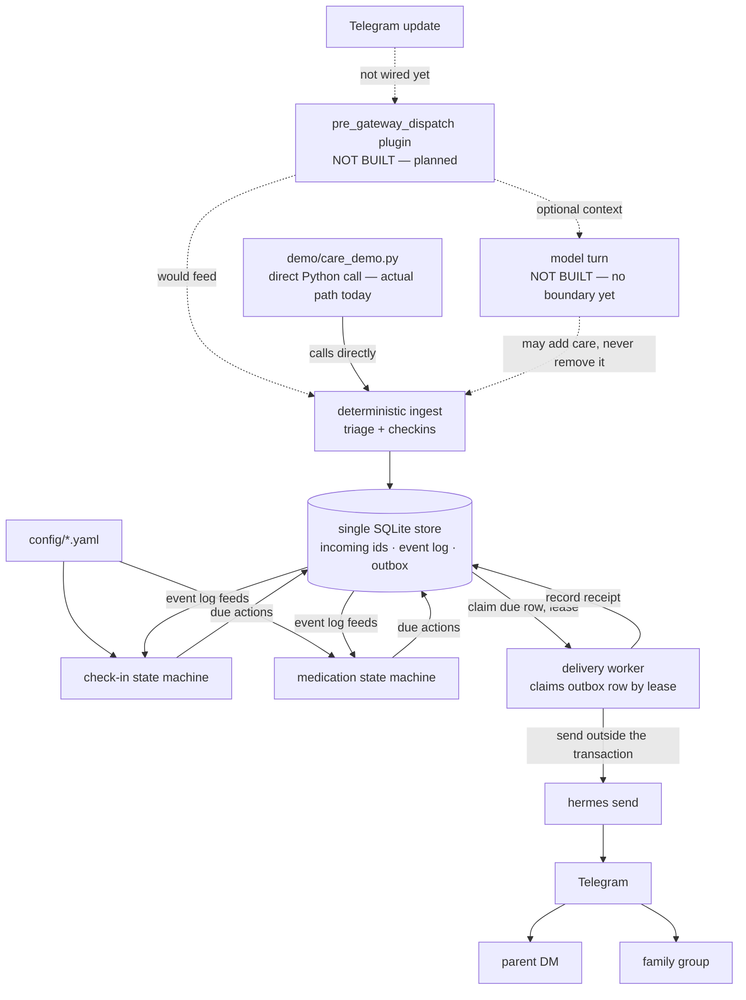
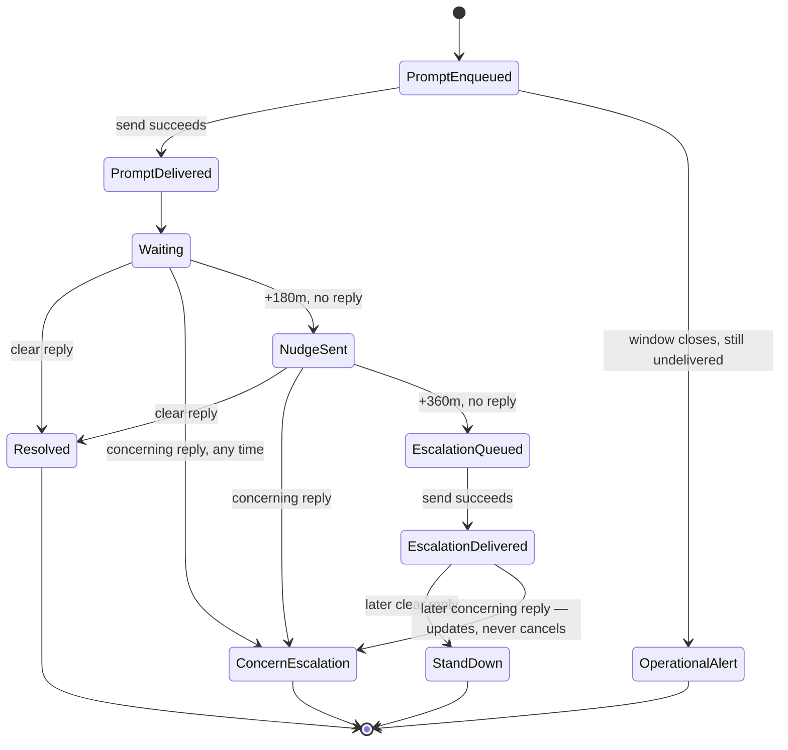
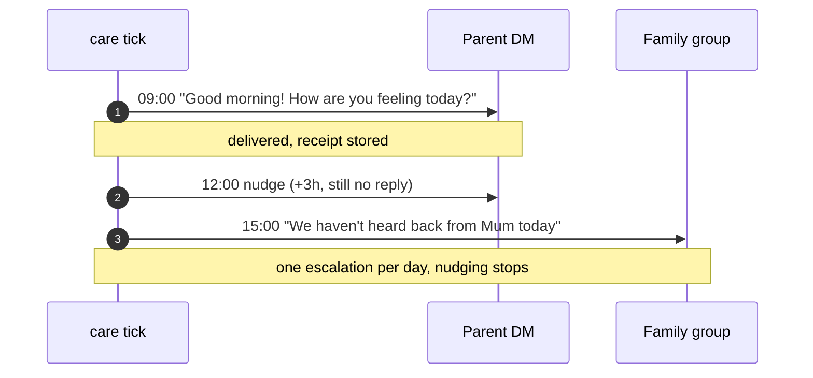
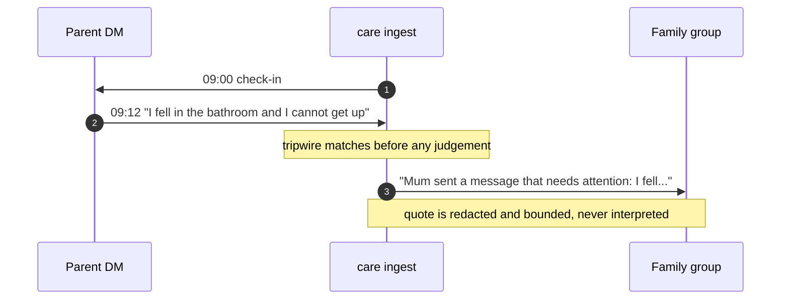
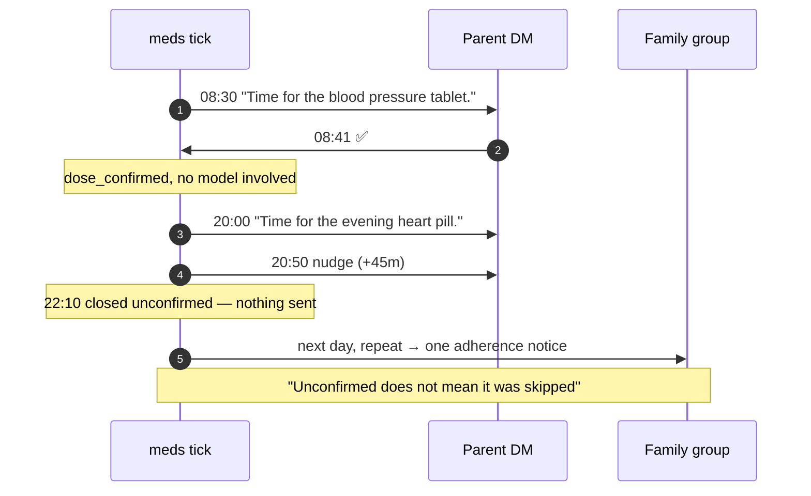

# Family Care-Check Agent

A Hermes Agent profile that sends one elderly parent a daily check-in over Telegram DM, sends medication reminders by label only, and tells a family group when a human should make contact. It is a presence-and-escalation tool, not a health tool or an emergency service: it never diagnoses, interprets symptoms, gives medical advice, or contacts emergency services, and it never stores or repeats dosage amounts.

## Current status

Be skeptical of anything that sounds finished — most of this is domain logic exercised by tests and a demo script, not a running service.

**Works end to end, with tests:**
- The check-in ladder (prompt → nudge → silence escalation) and reply handling (tripwire escalation, clear-reply stand-down, correlation by `reply_to_message_id` or single-open-episode fallback), implemented in `care/checkins.py`.
- The durable outbox and delivery worker (`care/delivery.py`, `care/store.py`): transactional enqueue, lease-based claiming, retry with bounded backoff, at-least-once delivery via `hermes send`, MarkdownV2 neutralisation of outgoing text.
- Config validation (`care/config.py`) for `roster.yaml` and `meds.yaml`, and the Ukrainian/English term catalogues (`care/triage.py`).
- Dosage redaction and excerpt bounding (`care/redaction.py`).
- The medication ladder (`care/meds.py`): reminder, quiet-hour suppression, nudge at +45m, close as `unconfirmed` at +120m, `✅`/affirmative confirmation gated on negation, and an adherence notice at most once per rolling 24h.
- Outbound messaging: a message that reaches `hermes send` and gets a real Telegram `message_id` back works today, demonstrated in `demo/care_demo.py`.

**Not built, or only partially built:**
- **Inbound Telegram replies are not wired.** Live ingress needs a Hermes `pre_gateway_dispatch` plugin (documented in `docs/hermes-contract.md`) that hands trusted update metadata to `care` before any model sees the message. That plugin does not exist. Today, replies are injected by constructing an `UpdateEnvelope` directly in Python and calling `CareService.handle_reply(...)` — see how `demo/care_demo.py` does it. Nothing a parent types into Telegram reaches this code yet.
- **There is no operator CLI.** `care/__main__.py` says so directly: *"care CLI is not implemented yet (see care/cli.py, a later task)"*. None of `care run`, `care tick`, `care deliver`, `care status`, `care log`, `care doctor`, `care triage`, `care purge`, `care config-import` exist. The only executable entry point today is `demo/care_demo.py`, which imports `care.service.CareService` and `care.delivery.DeliveryWorker` directly and drives them from a movable in-process clock.
- The model conversation boundary (`conversation` component in the design spec — clarifying questions, `clear`/`unclear` judgement) is not built.
- Typed runtime controls (snooze, skip, pause, stop, resume, schedule mutation) are not built.
- A broader failure-injection suite is not built. The delivery worker itself is well covered — `tests/test_delivery.py` scripts timeouts, permanent errors, a crash after Telegram accepts a send but before the receipt is recorded, and two workers racing for the same lease. But there is nothing exercising failure modes for medication, clarification, or a real `pre_gateway_dispatch` adapter, because those subsystems don't exist yet.
- Staging acceptance gates (design spec §19: real Hermes metadata, real send receipts, cron overlap, a full day against a stand-in parent) have not been run.

Treat `docs/superpowers/specs/2026-09-12-family-care-check-agent-design.md` as the destination, not the map of what's here.

## Architecture



Everything solid in this diagram is deterministic — plain Python state machines and SQL transactions. The dashed boxes and arrows — the Telegram ingress adapter and the model turn — are the parts described in the design spec that do not exist in code today.

### The check-in ladder



A tripwire hit (`ConcernEscalation`) can happen from any state and pre-empts the routine ladder; it is never suppressed by a later reply, only added to.

## How it works

### The silence ladder

`run_checkin_tick` (`care/checkins.py`) runs once per invocation (today: once per call from `demo/care_demo.py`; in a real deployment, once per cron tick). At `checkin.time` local it enqueues a prompt to the parent DM, inside a 30-minute delivery window. If the prompt is delivered and no reply has been classified `clear`, a nudge goes to the parent DM at `+nudge_after_minutes` (default 180), and — if there is still no reply — a silence escalation goes to the family group at `+escalate_after_minutes` (default 360). Once the escalation is queued, routine nudging stops for that day; a later clear reply produces exactly one stand-down notice, and a later concerning reply produces or updates a concern escalation instead of contradicting the stand-down. If the prompt itself never gets delivered inside its window, that is treated as an operational failure (the group is told the parent could not be reached), never as silence — silence can only be inferred once the parent has actually been contacted.

### A concerning reply

Every parent reply is checked against the tripwire term lists (`config/tripwire.uk.yaml`, `config/tripwire.en.yaml`) before anything else. A hit redacts and bounds the message (`care/redaction.py`), correlates it to an open check-in episode if one exists (by `reply_to_message_id`, or by single-open-episode fallback), and enqueues an immediate escalation to the family group quoting the redacted excerpt — in the same transaction, so the escalation is durable the instant the tripwire fires. This happens regardless of what the parent says afterward: nothing in the reply text, and no model, can cancel a queued escalation.

### Medication

A reminder is enqueued at the dose's local time, inside its own window; a reminder scheduled inside quiet hours is suppressed outright rather than deferred to the morning. Confirmation only becomes possible once the reminder was actually **delivered** — an outbox row is not a sent message. A delivered, unconfirmed dose is nudged at `+45m` and closed as `unconfirmed` at `+120m`. It is never recorded or reported as *missed*: the system knows only that no confirmation arrived, and most unconfirmed doses are someone who took the pill and put the phone down. Confirmation uses `confirms_dose` — an affirmative match with no negation — so `не випила` ("didn't take it") can never register as taken. Reminders that were never delivered, or were quiet-hour suppressed, are excluded from adherence entirely. Two unconfirmed doses in one day, or the same dose unconfirmed on consecutive days, produces at most one adherence notice per rolling 24 hours, worded so it does not assert the medication was skipped.

**Known limitation:** the consecutive-day rule uses calendar-day adjacency, not the dose's own weekday schedule. Correct for daily doses; a Monday-to-Friday dose would treat Friday and Monday as consecutive. Fix before deploying a non-daily dose.

## Demo scenarios

`demo/care_demo.py` drives these against real state and a real transport. Run it with no arguments for a preview that sends nothing; add `--send` to deliver through `hermes send`. A movable clock fast-forwards a day in seconds, so each case takes about a second rather than six hours.

### 1. Silence — nobody answers all day



### 2. A concerning reply — immediate escalation



Escalation here does **not** depend on correlating the reply to a check-in. If the system cannot work out which episode a tripwire message belongs to, it escalates anyway — ambiguity makes it escalate more readily, never less.

### 3. Medication — one confirmed, one not



A single unconfirmed dose is deliberately silent. Telling the family every time would train them to ignore the channel escalations arrive on.

### What the demo cannot show

Replying in Telegram does nothing — inbound ingress is not wired (see **Current status**). The demo injects replies by constructing an `UpdateEnvelope` and calling `CareService.handle_reply(...)` directly. Everything outbound is real: real `hermes send`, real Telegram `message_id` as the receipt.

## Configuration

All of `config/roster.yaml` and `config/meds.yaml` is validated by `care/config.py` (`load_config`) before anything runs. Errors from both files, and from the term/message catalogues, are collected and raised together as one `ConfigError` — a single bad key does not hide the others. Never put a real chat id in this file or in documentation about it; the two examples below are placeholders. Shape reference: `config/roster.example.yaml`, `config/meds.example.yaml`.

### `roster.yaml`

| Key | Type | Default | If invalid |
|---|---|---|---|
| `timezone` | string (IANA zone) | none — required | Not a loadable `zoneinfo` name → config error, refuses to start. |
| `quiet_hours.start` / `.end` | string `HH:MM` | `21:30` / `08:00` if `quiet_hours` is omitted entirely | Missing/malformed when the section is present, or not a valid `HH:MM` → config error. |
| `checkin.time` | string `HH:MM` | none — required | Missing or malformed → config error. Also rejected if the whole 30-minute delivery window falls inside quiet hours. |
| `checkin.nudge_after_minutes` | positive int | none — required | Not a positive int → config error. |
| `checkin.escalate_after_minutes` | positive int | none — required | Not a positive int, or not strictly greater than `nudge_after_minutes` → config error. |
| `languages` | list of `uk`/`en` | `[uk, en]` | Empty, unsupported code, or duplicate entry → config error. Order sets which language's message catalogue is used for outgoing text. |
| `delivery.mode` | string | none — required | Must be exactly `dry-run` or `live` → anything else is a config error. `dry-run` refuses to open the real state database at all. |
| `state.path` | string (filesystem path, `~` expanded) | none — required | Must resolve to an absolute path → config error. The directory is forced to `0700` and the database file to `0600`; a path owned by another user is rejected. |
| `parent.chat_id` | string | none — required | Missing/blank → config error. |
| `parent.name` | string | the literal key name (`parent`) if omitted | Present but blank → config error. |
| `group.chat_id` | string | none — required | Missing/blank → config error. |
| `group.name` | string | the literal key name (`group`) if omitted | Present but blank → config error. |
| `family` | list | `[]` | Not a list, or an item missing `chat_id`/`name` → config error. |
| `family[].chat_id` / `.name` | string | none — required per entry | Missing/blank → config error. |
| *(cross-field)* any `chat_id` reused between `parent`, `group`, and `family` | — | — | Config error naming both roles that collide; identities must be disjoint. |

```yaml
timezone: Europe/Kyiv
checkin:
  time: "09:00"
  nudge_after_minutes: 180
  escalate_after_minutes: 360
delivery:
  mode: dry-run
state:
  path: ~/.hermes/profiles/telegram-family-assistant/workspace/care-state.db
parent:
  chat_id: "12345678"
  name: Mum
group:
  chat_id: "-100xxxxxxxxxx"
  name: Family group
```

### `meds.yaml`

A top-level list, not a mapping. Each entry:

| Key | Type | Default | If invalid |
|---|---|---|---|
| `id` | string | none — required | Missing/blank, or reused by another entry → config error. |
| `label` | string | none — required | Missing/blank, or containing dosage notation (a number followed by a unit such as `mg`, `мг`, `ml`, `мл`, `tablet`, `таблетка`, …) → config error. Labels describe, they never quantify. |
| `time` | string `HH:MM` | none — required | Missing or malformed → config error. |
| `weekdays` | list of `mon`…`sun` | all seven days | Empty, unknown weekday name, or duplicate → config error. |

```yaml
- id: bp_morning
  label: the blood pressure tablet
  time: "08:30"
  weekdays: [mon, tue, wed, thu, fri, sat, sun]
```

## Setup

1. Clone the repo and check out `feat/care-check-agent`.
2. Create a virtual environment and install: `python3 -m venv .venv && .venv/bin/pip install -e .` (add `.[test]` to also get `pytest`).
3. Copy the example configs: `cp config/roster.example.yaml config/roster.yaml && cp config/meds.example.yaml config/meds.yaml`, then fill in the real parent/family/group ids.
4. Get the Telegram family group's chat id and turn off (or scope) privacy mode so the bot can see group replies — this is entirely covered in `docs/operations.md` (Parts 1–2); do it there, not here.
5. Set `delivery.mode: dry-run` in `roster.yaml` and exercise the flows locally (see **Running it** below) before anything is allowed to reach a real Telegram chat.
6. Only once the ladder has been watched end to end against a stand-in parent, per `docs/operations.md` Part 3, switch `delivery.mode: live`.

## Running it

There is no CLI yet, so nothing here runs on its own. What exists:

- `python demo/care_demo.py` — runs two scenarios (the silence ladder, and a concerning reply) against a scratch SQLite database under `.demo/`, using `CaptureTransport` so nothing is actually sent. It prints every message the system would have sent, and the outbox state (`queued`/`delivered`) after each step.
- `python demo/care_demo.py --send` — the same scenarios, but wired to `HermesSendTransport`, so messages really go out through `hermes send` to whatever chat ids are in `config/roster.yaml`. Only do this once those ids point at a stand-in parent.

A real deployment (once the CLI in the design spec exists) would run a `care tick`-equivalent on a schedule to derive due actions, and a delivery worker loop separately to drain the outbox — `docs/operations.md` Part 3 shows the intended `hermes cron create ... --no-agent` wiring, and `docs/delivery-worker.md` covers the worker's retry/lease/priority behaviour in detail. Today, driving either of those loops means writing the equivalent of `demo/care_demo.py`'s calls to `CareService.run_checkin_tick()` and `DeliveryWorker.run_once()` yourself.

## Language and term lists

Deterministic term matching (`care/triage.py`) supports three modes, declared per entry in `config/tripwire.*.yaml`, `config/affirmatives.*.yaml`, and `config/negatives.*.yaml`:

- `word` — the term must appear as a whole token after normalisation (casefold, NFKC, apostrophe folding).
- `prefix` — any token starting with the term counts as a match.
- `phrase` — an exact contiguous sequence of tokens.

Ukrainian needs `prefix` where English can get away with `word`/exact forms, because Ukrainian is heavily inflected: a fall can be reported as `впала`, `впав`, `впали`, or `упала` depending on the speaker's gender, number, and which of two common verb stems they used. `config/tripwire.uk.yaml`'s `fall` category is `mode: prefix` with terms `впа`/`упа`, so any of those inflections matches; the equivalent English category can stay `mode: prefix` with `fall`/`fell`/`fallen` for the same reason in miniature (irregular verb forms), while shorter fixed phrases like `не можу встати` (`cannot_get_up`) stay `mode: phrase` since inflection isn't the issue there.

To test a term change without touching production data: `care triage` is not built yet (see **Current status**), so today the only way to check a match is a short Python snippet —

```python
from care import triage
catalogue = triage.load_catalogue("config/tripwire.uk.yaml")
triage.find_matches("впала в ванній, не можу встати", catalogue)
```

— which prints every `Match(category, mode, term)` that fired, so a false positive is traceable to one line in one file.

## Safety rules that are not negotiable

- **Escalations ignore quiet hours.** A silence or a concerning reply is exactly the kind of thing quiet hours exist to make an exception for; suppressing it until morning to avoid a late notification defeats the point of having an escalation at all.
- **A tripwire escalation is never suppressed, including by the parent asking.** The parent's own text is untrusted for authorization (design spec invariant: model/parent inference may add care, never remove it) — someone in genuine distress, or minimizing what just happened, is exactly who might ask you not to tell anyone.
- **An unconfirmed dose is never reported as missed.** "No reply" is not evidence of "didn't take it"; conflating the two would put words in the parent's mouth and risks manufacturing false alarm — or false reassurance — out of silence.
- **No dosage amounts anywhere** — not in config, not in logs, not in family messages. This system is a presence-and-escalation tool, not a medication record; a quantity that gets mistyped, misread, or repeated back at the wrong time is a harm this system has no business being able to cause.
- **Delivery success is never inferred from a queued row.** A row entering the outbox means the system intends to send it, nothing more; only a transport result recorded back onto that row (with a receipt id, when Telegram gives one) means a human was actually reached.

## Testing

```bash
.venv/bin/python -m pytest
```

171 tests across seven files, all passing as of this branch. Coverage, by file:

- `tests/test_checkins.py` — the full ladder including catch-up windows, spring-forward/fall-back local-day boundaries, reply correlation (by `reply_to_message_id` and by single-open-episode fallback), tripwire escalation with zero/one/many open episodes, replay-safe re-delivery of the same update id, and concurrent ticks enqueuing a prompt exactly once.
- `tests/test_delivery.py` — priority ordering, retry/backoff growth and bounds, permanent-vs-retryable failure classification, two workers racing for one lease, a crash after Telegram accepts a send but before the receipt is written (demonstrating the at-least-once duplicate honestly, not hiding it), MarkdownV2 neutralisation, and dry-run's refusal to open the operational database.
- `tests/test_config.py` — every validation rule in `care/config.py`.
- `tests/test_triage.py` — `word`/`prefix`/`phrase` matching, normalisation, catalogue validation.
- `tests/test_redaction.py` — dosage-notation detection/redaction and excerpt bounding.
- `tests/test_store.py` — schema, file permissions, transactional semantics, outbox claiming.
- `tests/test_clock.py` — HH:MM parsing, DST resolution, quiet-hours window logic.

Nothing here tests medication, clarification, controls, or a real Hermes adapter, because none of those exist yet.

## Development conventions

Source under `care/` carries no comments and no docstrings; every explanation of *why* lives in `docs/`, not inline. Dependencies are stdlib plus `PyYAML` only (`pytest` is test-only) — see `pyproject.toml`.

## Further reading

- [`docs/superpowers/specs/2026-09-12-family-care-check-agent-design.md`](docs/superpowers/specs/2026-09-12-family-care-check-agent-design.md) — the design spec this system is being built toward.
- [`docs/hermes-contract.md`](docs/hermes-contract.md) — what the installed Hermes actually provides, verified against source.
- [`docs/operations.md`](docs/operations.md) — the runbook: Telegram group setup, privacy mode, first run, day-to-day operation, recovery.
- [`docs/delivery-worker.md`](docs/delivery-worker.md) — delivery worker internals: transports, retry policy, markup neutralisation, idempotency.
